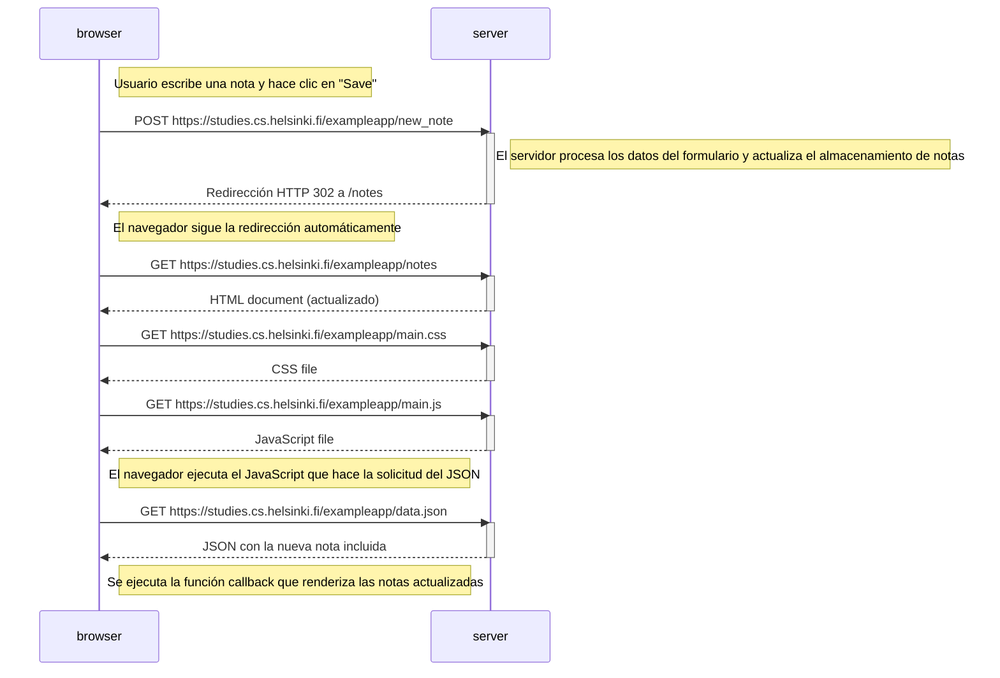
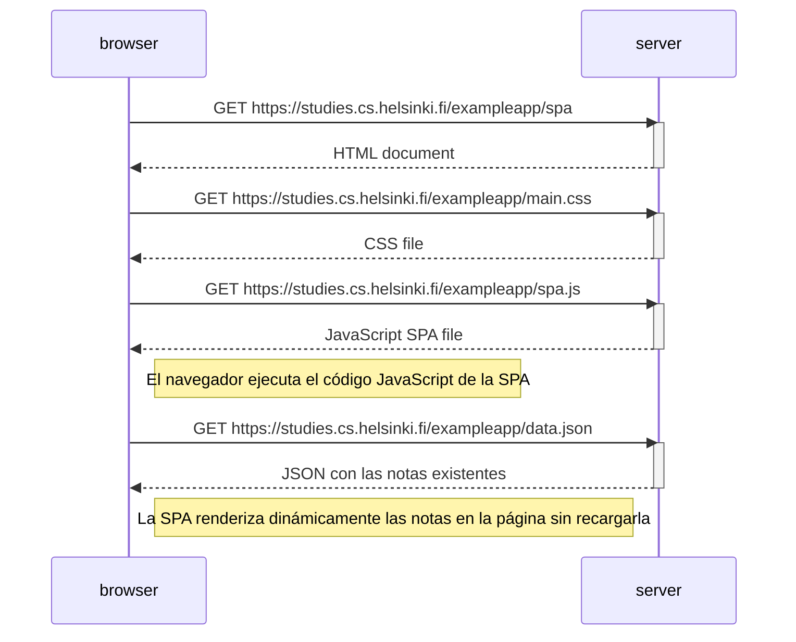

# fullstackopen
Este repositorio está hecho para agregar las soluciones a los diferentes retos impuestos por el Bootcamp Full Stack Open. www.fullstackopen.com

# 0.4 Diagrama de Secuencia: Crear una Nueva Nota
 

# 0.5 Diagrama de Secuencia: Acceso a la versión SPA de la aplicación de notas

